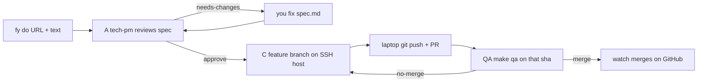

# Forgeyard

Spec-driven AI software factory. Laptop is the remote. SSH host is the workbench.
Watch is deterministic. Pi is the only LLM process. Three roles: tech-pm, developer, qa.

**Status:** specification is v0-complete. Rust binaries and `install.sh` are next. Commands below are the contract the binaries must implement.

## Test scenario (what you will run)

1. You create a **separate** GitHub repo with `spec.md` in the root and a `Makefile` target `qa` (`make qa`).
2. Do **not** turn on required approving reviews on that repo.
3. Factory is installed and onboarded on a Mac. `fy start` is running.
4. You type `fy do <repo-or-issue-url> implement the spec`.
5. Watch: A review spec → (B if large) → C implement on the SSH host → laptop pushes PR → QA `make qa` on that sha → watch merges.

That path is specified. It cannot run until `fy` exists. The spec does not have a remaining logic hole that would block that path.

## Install (Mac, Apple Silicon)

Need on the laptop: `git`, `ssh`, later `pi` and `gh` (installer should fetch `pi` if missing).

```sh
curl -fsSL https://raw.githubusercontent.com/camorazrushimoe/forgeyard/main/install.sh | sh
```

Until the script exists, that line is what it will do: drop `fy` / `forge` / `watch` / `yard` + pack into `~/.forgeyard`, put `fy` on PATH.

```text
installed.

next:
  fy onboard
  fy help
```

## Onboard

```sh
fy onboard
```

One field at a time, tokens hidden:

1. Telegram bot token (empty = skip yard)
2. LLM endpoint — any OpenAI-compatible base URL  
   examples: `https://openrouter.ai/api/v1`, `https://api.openai.com/v1`, `http://192.168.1.20:8080/v1`
3. LLM token (dummy ok if the local server does not care)
4. GitHub PAT (`repo`: issues, PRs, merge). Same account will open and merge PRs.
5. SSH host (`user@host` or `user@host:port`)
6. SSH password

Secrets land in `~/.forgeyard/factory/tokens/tokens.toml` mode 0600. Never in the event log.

## Use

Two terminals.

```sh
# terminal 1 — keep open; this is the factory heartbeat
fy start
```

```sh
# terminal 2 — give work
fy do https://github.com/YOU/toy implement the spec.md in this repo

# or an issue
fy do https://github.com/YOU/toy/issues/1 do this ticket against the spec
```

`fy do` does not call the LLM. It binds the project, writes `inbox.md`, appends the log. Watch picks it up.

Other commands:

```text
fy help
fy status
fy stop
fy bind URL     # attach without a prompt; fy do is enough for the first run
```

Telegram `/status` is optional. First runs should use the terminal.

## What the factory expects from your project repo

| file | why |
|---|---|
| `spec.md` | without it watch stays blocked-on-spec |
| `Makefile` with `qa` | QA runs `make qa` on the cluster checkout |
| default branch unprotected by required reviews | watch merges with your PAT |

On the SSH host the clone will appear at `/srv/forgeyard/<repo-name>/repo/` (created on first implement).

## How a job moves



Pi stays on the Mac. It only SSHes into the workbench. GitHub PAT never written to the server.

## Pieces

| piece | job |
|---|---|
| `fy` | what you type |
| `forge` | hooks, envelope, spec gate, log |
| `watch` | state machine, no LLM |
| `yard` | Telegram |
| `pi` | one session per run |

## Spec map

- [SPEC.md](SPEC.md) — kernel
- [spec/watch.md](spec/watch.md) — A–E
- [spec/intake.md](spec/intake.md) — `fy do`
- [spec/onboard.md](spec/onboard.md) / [spec/cli.md](spec/cli.md) / [spec/install.md](spec/install.md)
- [spec/cluster.md](spec/cluster.md) / [spec/github-auth.md](spec/github-auth.md) / [spec/github-facts.md](spec/github-facts.md)
- [spec/llm.md](spec/llm.md) / [spec/qa-command.md](spec/qa-command.md)
- [spec/adversarial-review-v0.md](spec/adversarial-review-v0.md)
- [roles/](roles/) [skills/](skills/)

## License

MIT. See [LICENSE](LICENSE).
