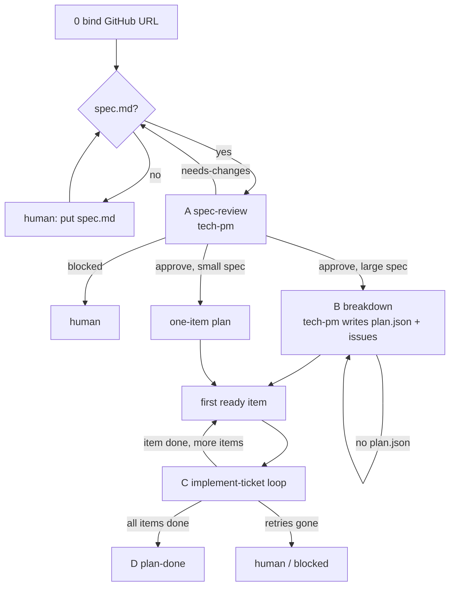
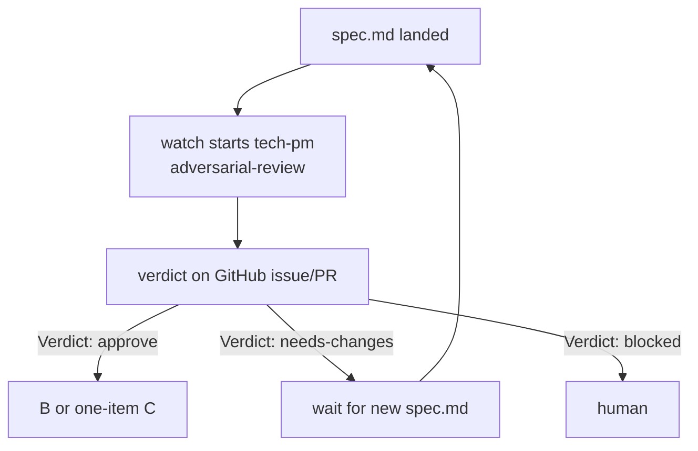
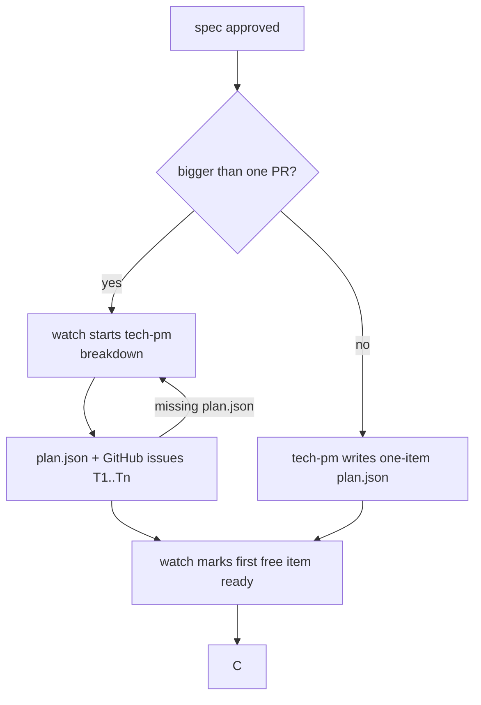
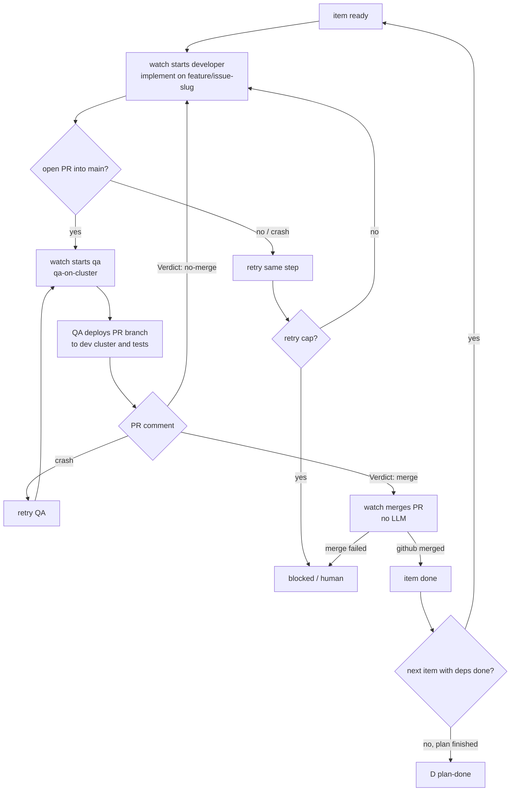
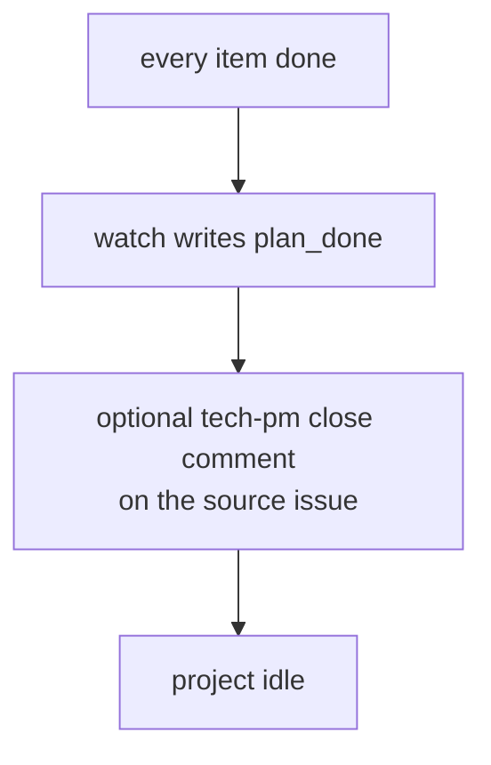
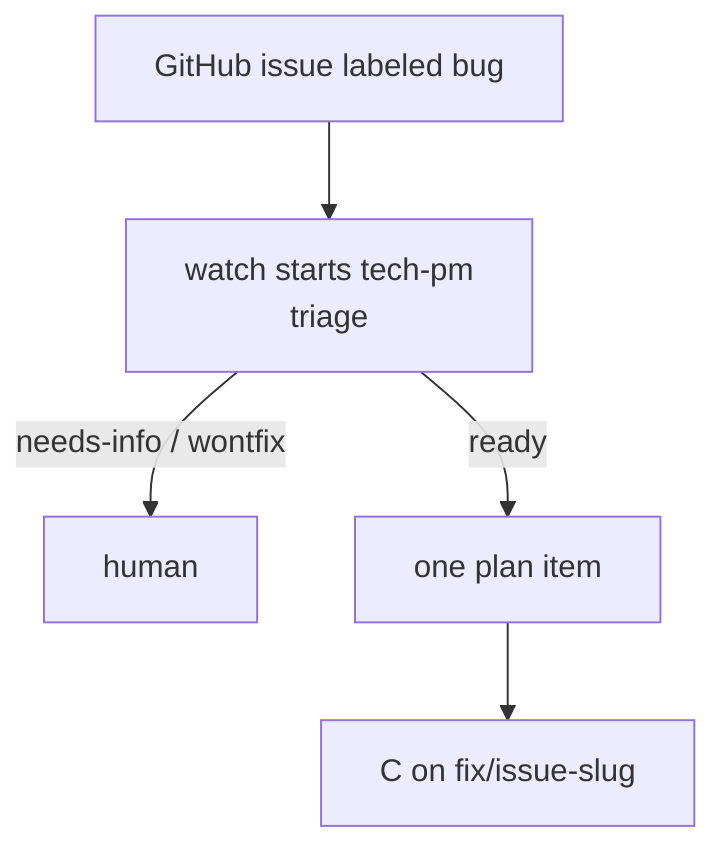

# Forgeyard

Deterministic kernel for a spec-driven AI software factory.

Install on a laptop should feel like one command: binaries + pack (roles, skills) + Pi runner.

| piece | kind | job |
|---|---|---|
| `forge` | static Rust CLI | bind GitHub project, spec gate, hooks, envelope, event log |
| `yard` | static Rust daemon | Telegram control panel |
| `watch` | static Rust loop | deterministic scenario driver (no LLM) |
| `pi` | external harness | the one process that may read/write files and run bash |
| pack | files in this repo | three roles + skills |

There is **one** Pi process per run. Role is chosen per session: `tech-pm`, `developer`, or `qa`.

Merge gate: developer opens a PR from a feature branch; QA deploys that branch to the dev cluster and writes `Verdict: merge` or `Verdict: no-merge`; `watch` merges only on `merge`.

No Hermes. No Redis. No Linear. No DevOps role.

## Watcher loops

`watch` has no LLM. It reads facts (`spec.md`, `plan.json`, PR, verdict line, event log) and starts the next legal `forge run`.
Full contract: [spec/watch.md](spec/watch.md).

### How the factory walks a spec

### A. Spec review

### B. Breakdown

### C. Implement ticket — main loop

Feature branch → PR into main. Developer does not merge and does not deploy.
QA deploys that branch to the dev cluster and writes the merge gate on the PR.
Watch merges only on `Verdict: merge`.

### D. Plan done

### E. Bugfix

Same C loop. Different entrance and branch prefix (`fix/` instead of `feature/`).

## Spec map

- [SPEC.md](SPEC.md) — kernel
- [spec/watch.md](spec/watch.md) — watcher + scenarios A–E
- [spec/telegram-panel.md](spec/telegram-panel.md) — `yard`
- [spec/tokens.md](spec/tokens.md) — secrets
- [spec/pi-runner.md](spec/pi-runner.md) — how Pi is wrapped
- [spec/install.md](spec/install.md) — one-command install
- [spec/roles-and-skills.md](spec/roles-and-skills.md) — pack layout
- [roles/](roles/) — three role files
- [skills/](skills/) — factory skills

## Status

Specification + pack files. Rust binaries and `install.sh` come next.

## License

MIT. See [LICENSE](LICENSE).
