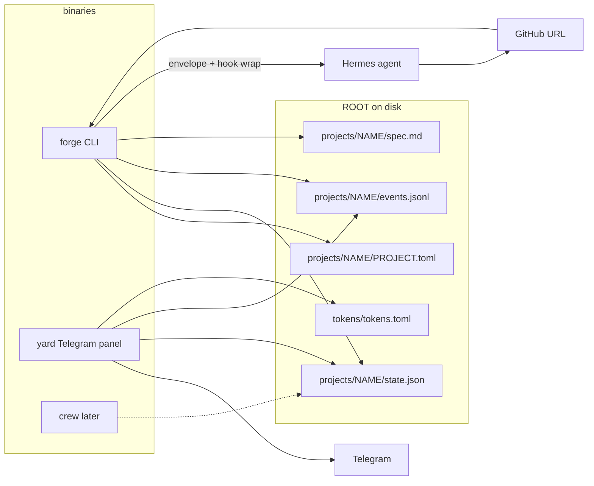
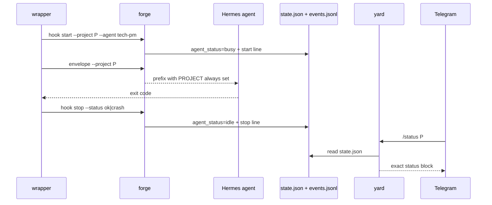

# Architecture

```mermaid
flowchart LR
    subgraph binaries
      F[forge CLI]
      Y[yard Telegram panel]
      C[crew later]
    end
    subgraph disk["ROOT on disk"]
      T[tokens/tokens.toml]
      P[projects/NAME/PROJECT.toml]
      S[projects/NAME/state.json]
      L[projects/NAME/events.jsonl]
      SP[projects/NAME/spec.md]
    end
    H[Hermes agent]
    TG[Telegram]
    GH[GitHub URL]

    GH --> F
    F --> P
    F --> S
    F --> L
    F --> SP
    F -->|envelope + hook wrap| H
    H --> GH
    Y --> TG
    Y --> S
    Y --> L
    Y --> T
    C -.-> S
```

```mermaid
sequenceDiagram
    participant W as wrapper
    participant F as forge
    participant A as Hermes agent
    participant D as state.json + events.jsonl
    participant Y as yard
    participant T as Telegram

    W->>F: hook start --project P --agent tech-pm
    F->>D: agent_status=busy + start line
    W->>F: envelope --project P
    F-->>A: prefix with PROJECT always set
    A-->>W: exit code
    W->>F: hook stop --status ok|crash
    F->>D: agent_status=idle + stop line
    T->>Y: /status P
    Y->>D: read state.json
    Y-->>T: exact status block
```
